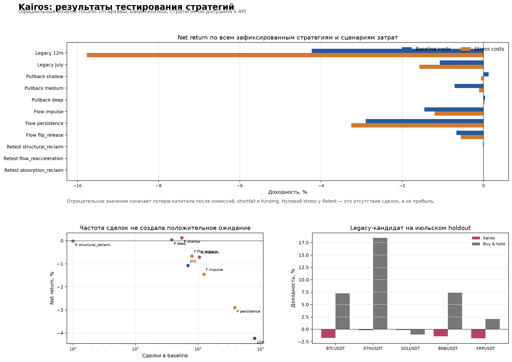

# Kairos — отчёт по трём прогонам стратегий

**Дата отчёта:** 2026-08-20  
**Статус:** исследовательская диагностика, не разрешение на paper/live trading  
**Решение по всем трём новым семействам:** `REJECT_ALL`

## Короткий вывод

Зафиксированы три отдельных прогона гипотез на пяти фьючерсных символах Binance
USD-M: pullback/reclaim, order-flow expansion и regime/retest reclaim. Все они
проводились офлайн, без реальных API-запросов и без заявок на биржу. В каждом
случае применялись две одинаковые для сравнения стороны оценки: `baseline` и
консервативный `stress`.

Главный результат простой:

- увеличение частоты само по себе не создало преимущество: `PERSISTENCE` дал
  387 baseline-сделок, но результат составил **−2,9005%**;
- более строгая логика иногда оставляла положительный маленький результат, но
  с десятками сделок это не является доказательством: `DEEP` дал +0,0406% на
  38 сделках и +0,0267% на 10 сделках;
- самая сложная цепочка фильтров стала чрезмерно узкой: из 41 741 кандидата
  до исполнения дошла только одна baseline-сделка;
- ни один прогон не достиг собственного минимального gate по частоте и
  положительной экономике. Поэтому подключать стратегию к API или капиталу на
  основании этих результатов нельзя.



## Что означает «масштаб прогона»

Под масштабом здесь понимается не только число сделок. Для каждого прогона
зафиксированы:

1. временное окно генерации и оценки;
2. длительность прогрева и роль данных (`RESEARCH`, reused development, не OOS);
3. число символов, архивов и минутных строк;
4. число вариантов стратегии и сценариев стоимости;
5. начальный капитал и способ его распределения;
6. число кандидатов, сигналов и фактически закрытых сделок;
7. результаты после комиссий, shortfall и stress-допущений.

Во всех трёх новых прогонах использовались одни и те же пять символов:
`BTCUSDT`, `ETHUSDT`, `SOLUSDT`, `BNBUSDT`, `XRPUSDT`.

## Сводная таблица трёх прогонов

| Прогон | Окно оценки | Масштаб данных | Варианты × сценарии | Сделки baseline / stress | Итог |
|---|---|---|---:|---:|---|
| 1. Pullback/reclaim | 2023-01-01 — 2023-07-01, 35 дней warm-up | 40 месячных ZIP, 1 742 400/1 742 400 валидных 1m-строк | 3 × 2 | 55–105 / 10–41 | `REJECT_ALL` |
| 2. Order-flow expansion | 2022-07-01 — 2023-01-01, генерация с 2022-05-27 | 5 символов, закрытые 5m flow-бары из минутных данных, все 11 полей Candle | 3 × 2 | 80–387 / 60–301 | `REJECT_ALL` |
| 3. Regime/retest reclaim | 2024-02-01 — 2024-07-01, 62 дня warm-up с 2023-12-01 | 35 ZIP, 1 533 600/1 533 600 валидных 1m-строк | 3 × 2 | 1 / 0 | `REJECT_ALL` |

Начальный капитал в первых двух development screens составлял $100 000. В
третьем прогоне капитал распределялся равными долями по пяти символам
($20 000 на символ). Это исследовательский масштаб, а не размер будущего
счёта.

## Прогон 1 — trend pullback/reclaim

### Что проверяли

Три глубины одного семейства `trend_pullback_reclaim_v1`:

- `SHALLOW` — более частый pullback;
- `MEDIUM` — средняя строгость;
- `DEEP` — более глубокий pullback.

Для каждого варианта одновременно проверялись baseline и stress. Минимальный
gate требовал не менее 100 закрытых сделок, положительный log-growth, PF выше
1 и положительную expectancy в каждом сценарии.

### Результаты

| Вариант | Сценарий | Сделки | Net return | PF | Expectancy/сделка | Max DD |
|---|---|---:|---:|---:|---:|---:|
| Shallow | Baseline | 55 | **+0,1249%** | 1,130 | +$0,76 | 0,2926% |
| Shallow | Stress | 16 | **−0,0568%** | 0,840 | −$1,18 | 0,1954% |
| Medium | Baseline | 105 | **−0,7125%** | 0,683 | −$2,26 | 0,9611% |
| Medium | Stress | 41 | **−0,1080%** | 0,887 | −$0,88 | 0,3330% |
| Deep | Baseline | 38 | **+0,0406%** | 1,051 | +$0,36 | 0,2871% |
| Deep | Stress | 10 | **+0,0267%** | 1,104 | +$0,89 | 0,1847% |

### Понятный смысл

`MEDIUM` доказал, что система может генерировать больше сигналов, но эти
сигналы экономически отрицательны. `SHALLOW` показывает небольшой плюс только
в мягком сценарии и теряет его в stress. `DEEP` выглядит лучше по знаку, но
38 и 10 сделок — слишком маленькая выборка; это не основание считать вариант
прибыльным.

**Решение:** все три варианта отклонены.

## Прогон 2 — order-flow volatility expansion

### Что проверяли

Три взаимно исключающих flow-гипотезы на закрытых 5-минутных барах:

1. `IMPULSE` — сильный текущий directional imbalance;
2. `PERSISTENCE` — направленный flow сохраняется три бара;
3. `FLIP_RELEASE` — текущий flow разворачивается после трёх баров
   противоположного imbalance.

Признаки строились только из доступных на тот момент данных: prior median
quote-volume, prior Wilder ATR, range expansion, taker share и CLV. Baseline и
stress получали один и тот же inventory сигналов; менялись только admission,
fills и costs.

### Результаты

| Вариант | Сценарий | Сделки | Net return | PF | Expectancy/сделка | Max DD |
|---|---|---:|---:|---:|---:|---:|
| Impulse | Baseline | 124 | **−1,4559%** | 0,356 | −$11,74 | 1,5654% |
| Impulse | Stress | 92 | **−1,2052%** | 0,354 | −$13,10 | 1,2914% |
| Persistence | Baseline | 387 | **−2,9005%** | 0,574 | −$7,49 | 2,9560% |
| Persistence | Stress | 301 | **−3,2540%** | 0,448 | −$10,81 | 3,2893% |
| Flip-release | Baseline | 80 | **−0,6709%** | 0,542 | −$8,36 | 0,7627% |
| Flip-release | Stress | 60 | **−0,5590%** | 0,522 | −$9,32 | 0,6374% |

Самый частый вариант, `PERSISTENCE`, как раз наиболее наглядно показывает
проблему: частота была достаточной, но PF заметно ниже 1 и expectancy
отрицательна во всех пяти символах. Stop loss был самым частым выходом:
78/124 для impulse, 241/387 для persistence и 50/80 для flip-release в
baseline.

**Решение:** все три варианта отклонены. Более высокая частота не компенсирует
отсутствие edge.

## Прогон 3 — regime/retest reclaim

### Что проверяли

Три варианта одной state-machine:

- structural reclaim;
- flow reacceleration;
- absorption reclaim.

Стратегия требовала одновременно regime veto, expansion, retest границы,
reclaim и cost-aware admission.

### Воронка сигналов

```text
41 741 breakout candidates
        │  regime veto пропустил только 2 115
        ▼
  184 armed retest setups
        ▼
   12 structural reclaims
        ├── 2 flow-reacceleration intents
        └── 0 absorption intents
        ▼
   1 baseline trade / 0 stress trades
```

Только 0,029% исходных breakout-кандидатов дошли до structural reclaim. Все
12 reclaims оказались long; ни один short reclaim не пережил комбинацию
фильтров. Это проблема калибровки логической связки, а не доказательство, что
short-направление нужно удалить.

### Результаты

| Вариант | Сценарий | Intent'ы | Сделки | Net return | PF | Expectancy |
|---|---|---:|---:|---:|---:|---:|
| Structural reclaim | Baseline | 9 eval | 1 | **−0,0155%** | 0,000 | −$15,49 |
| Structural reclaim | Stress | 9 eval | 0 | 0,0000% | N/A | $0,00 |
| Flow reacceleration | Baseline | 2 | 0 | 0,0000% | N/A | $0,00 |
| Flow reacceleration | Stress | 2 | 0 | 0,0000% | N/A | $0,00 |
| Absorption reclaim | Baseline | 0 | 0 | 0,0000% | N/A | $0,00 |
| Absorption reclaim | Stress | 0 | 0 | 0,0000% | N/A | $0,00 |

Единственная baseline-сделка была long XRPUSDT и закрылась по stop loss:
reference gross −$8,00, execution gross −$11,00, fees −$4,50,
implementation shortfall −$3,00, итоговый net PnL −$15,49.

**Решение:** все три варианта отклонены. Здесь стратегия стала настолько
строгой, что в основном измерила собственную редкость, а не прибыльность.

## Контрольный legacy-прогон

Для контекста в репозитории также сохранён более ранний baseline старой
мультитаймфреймовой стратегии. Это не один из трёх новых development screens,
а контрольная точка, с которой сравнивались новые гипотезы.

| Окно | Масштаб | Baseline | Stress | Сделки |
|---|---|---:|---:|---:|
| 12 месяцев research | 5 символов, 300 pre-holdout архивов, 13 132 799 валидных строк | −4,2317% | −9,7632% | 803 / 804 |
| Июльский holdout legacy | 5 символов, 223 200 полных строк | −1,0760% | −1,5781% | 69 / 69 |

В июльском окне equal-weight buy-and-hold составил +6,8286%, а положительных
символов у стратегии было 0/5. Этот holdout уже нельзя считать новым blind
тестом: он был использован legacy-кампанией и теперь является reused robustness
данными.

## Почему все результаты отрицательные или недостаточны

В трёх прогонах проявились разные, но связанные причины:

- **частотная гипотеза без edge:** order-flow persistence дала много сделок,
  но каждый trade в среднем терял деньги;
- **слишком сильное ужесточение:** regime/retest оставила одну сделку, поэтому
  не создала статистически проверяемый поток;
- **чувствительность к costs:** комиссия, shortfall и adverse funding
  ухудшают уже слабый или около нулевого raw edge;
- **нет реальной venue-истории:** Binance используется как proxy; исторические
  EVEDEX funding, order book, depth, trades, OI и liquidations в этих прогонах
  отсутствуют;
- **нет честного нового OOS:** все три новых экрана имеют статус reused
  development data, `out_of_sample=false`, `real_api_allowed=false`.

Это не означает, что архитектура бесполезна. Наоборот, тестовый контур смог
показать, где стратегия должна быть отклонена: он не принял маленький плюс как
доказательство, не спутал количество сделок с качеством и не разрешил торговлю
при нулевой выборке.

## Что эти прогоны разрешают делать дальше

Разрешено:

- использовать результаты как диагностику дизайна сигналов, costs и частоты;
- проектировать новую, структурно отличную гипотезу на заранее объявленном
  окне и с новым trial identity;
- подключать инфраструктурные paper/API smoke-тесты без включения стратегии и
  без денежных заявок.

Не разрешено:

- включать любую из трёх стратегий в paper/live как «прошедшую»;
- выбирать лучший вариант только по знаку доходности при 10–38 сделках;
- ослаблять фильтры задним числом на тех же интервалах;
- выдавать Binance-результаты за доказательство ликвидности EVEDEX;
- считать этот отчёт прогнозом доходности или подтверждением цели 30% в месяц.

## Источники и воспроизводимость

Подробные первичные отчёты и полные JSON-артефакты сохранены рядом:

- [Pullback/reclaim report](development-screen/REPORT.md)
  · [summary.json](development-screen/summary.json)
- [Order-flow report](orderflow-screen/REPORT.md)
  · [summary.json](orderflow-screen/summary.json)
- [Regime/retest report](regime-retest-screen/REPORT.md)
  · [summary.json](regime-retest-screen/summary.json)
- [Legacy validation report](../README.md#frozen-legacy-offline-validation-data-through-2026-07-31)

Все три development screen завершились `REJECT_ALL`; их permissions остаются
`promotion_eligible=false`, `shadow_allowed=false`, `live_allowed=false`.
